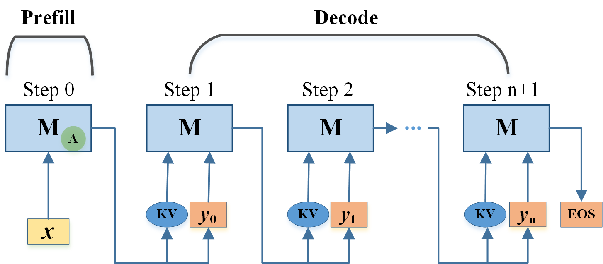

#  PrAd: Prompt Adaptive Tuning for Decoder-only Language Models

This is the official implementation for  [PrAd: Prompt Adaptive Tuning for Decoder-only Language Models](https://aclanthology.org/2025.findings-emnlp.254.pdf) (Findings EMNLP 2025). If you have any questions, feel free to contact:  mayou_5@163.com
**The core idea of PrAd is to introduce adapters only in the prefill phase, leaving the decoding phase untouched, thereby introducing no overhead in the decoding phase.** 

## Abstract

Fine tuning pretrained language models for downstream NLP tasks, while effective, can be costly when the model size and the number of tasks increase, as it requires full parameter updates and a separate model served for each task. Parameter-efficient tuning (PET) addresses the issue by keeping the pretrained parameters fixed while introducing minimal task-specific parameters. There are two essential PET paradigms: prompt-based tuning and adapter-based tuning, each with distinct limitations. Prompt-based methods suffer from increased input lengths and sensitivity to weight initialization, whereas adapter approaches can substantially increase inference time. To overcome these limitations, we propose prompt adaptive tuning (PrAd), a general prompt-based tuning framework for decode-only models that delivers strong performance with high efficiency, even in multi-task scenarios. Unlike conventional prompt-based tuning which uses soft tokens to “wrap” inputs, PrAd employs adapters for flexible input transformation. While traditional adapter-based tuning adapts both the prompt and decoded tokens, PrAd only adapts the prompt. PrAd enables the creation of diverse prompt-based approaches while providing critical advantages for real-world use: (1) it can maintain original input lengths with easy initialization during training, like adapter-based methods; (2) it can reduce management costs while facilitating deployment and efficient batch inference of different tasks, like prompt-based tuning.; and (3) it introduces no additional inference latency in the decoding phase even when serving multiple tasks concurrently. Experiments on six diverse tasks demonstrate that PrAd can consistently attain comparable or better performance and higher inference efficiency.

## Architecture

The architecture of PrAd is shown as below, where "M" stands for the Pretrained Language Model which is frozen, "A" stands for the adapter which is trainable and only used in the prefill Phase.

{width=0.8\linewidth}


## References

We used code from the following git repositories:

- [kernel-adapters](https://github.com/ychen-stat-ml/kernel-adapters)
- [VGLM](https://github.com/zlinao/VGLM)
- [stanford_alpaca](https://github.com/tatsu-lab/stanford_alpaca)

We didn't include the evaluation code in our repository for simplicity.  You can use the following resource for evaluation: 

- [e2e_evaluation](https://github.com/younengma/e2e_metrics)
- [webnlg_evaluation](https://github.com/ychen-stat-ml/kernel-adapters)
- Metrics for others tasks, e.g.  BLEU (MT), Rouge (XSUM),  Accuracy (SST2, MNLI) ,  you can simply use the `evaluate` package.

If you find our method helpful, feel free to cite our article:

```
@inproceedings{ma-etal-2025-prad,
    title = "{P}r{A}d: Prompt Adaptive Tuning for Decoder-only Language Models",
    author = "Ma, Youneng  and
      He, Junyi  and
      Fei, Haojun",
    editor = "Christodoulopoulos, Christos  and
      Chakraborty, Tanmoy  and
      Rose, Carolyn  and
      Peng, Violet",
    booktitle = "Findings of the Association for Computational Linguistics: EMNLP 2025",
    month = nov,
    year = "2025",
    address = "Suzhou, China",
    publisher = "Association for Computational Linguistics",
    url = "https://aclanthology.org/2025.findings-emnlp.254/",
    doi = "10.18653/v1/2025.findings-emnlp.254",
    pages = "4729--4743",
    ISBN = "979-8-89176-335-7"
}
```


